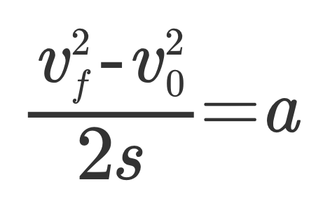
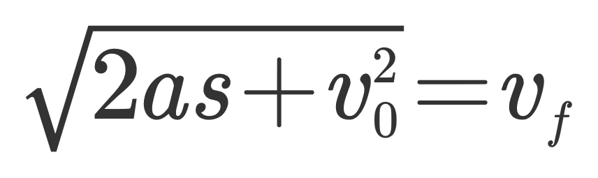
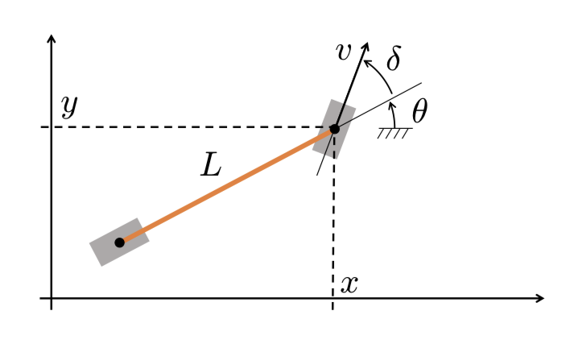
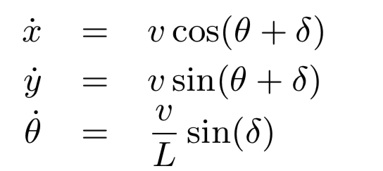
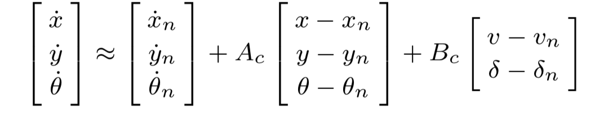
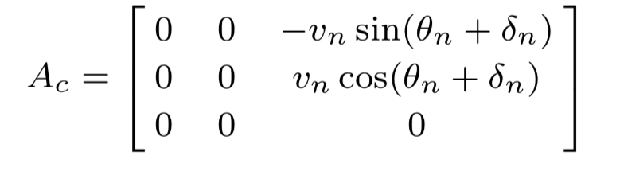
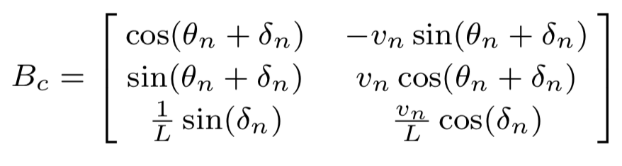

# Motion-Planning for Autonomous driving

## 1. Objective
In this project, i have designed a Motion Planning approach based on Self-driving specilization course and implemented correspond algorithm using Python. The approach is simulated and tested in Carla simulaitor, which is a solid and modificable opensource project aiming to make it easy for autonomous-driving test/simulation in complex and various situations.

The Motion-Planning objective in this project is splited into three subtasks: behavioural planner, local planner and velocity planner. Behavioural planner is based on finite state machine. For simplicity, only simple situation is considered. That is to say, this FSM has three states: follow-lane, decelerate-to-stop and stay-stopped. Local planner has three subtasks: goal state set generation, path optimization for different goal state candidates and collision checking. In this step, local planner gives the optimal collision-free path and discretizes this path by generating a set of sequential waypoints in global frame/coordinate system. Velocity planner generates corresponding reference velocity according to the discretized sequential waypoints.

### Motion Planning in the case of obstacle avoidance

### Motion Planning in the case of stop sign

## 2. Brief introduction for different subsystems

### 2.1 Behavioural Planner

### 2.2 Local Planner

### 2.3 Velocity Planner
#### Use simple ramp velocity profile
 
#### Use trapezoidal profile

## 3. Model Predictive Control approach for autonomous driving
In addition, a MPC is designed for trajectory tracking.
### 3.1  Kinematic model

The state equation:

The linearized model:

The jacobian matrix A and B:

In order to solve this MPC optimisation problem, a QP solver is used. The required constraints and parameters will be adaptively and dynamically computed for QP solver.

